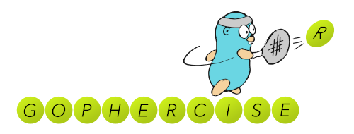

[QSEST]: https://community.qlik.com/t5/Qlik-Scalability/Qlik-Sense-Enterprise-Scalability-Tools/gpm-p/1579916
[wiki]: https://github.com/qlik-oss/gopherciser/wiki
[enigma-go]: https://github.com/qlik-oss/enigma-go
[build-cli]: ./docs/dev/build.md
[build-docker]: ./docs/dev/docker.md
[architecture]: ./docs/dev/architecture.md
[develop]: ./docs/dev/develop.md



---

[](https://circleci.com/gh/qlik-oss/gopherciser)

[wiki] | [QSEST] | [enigma-go] | [build-cli] | [build-docker] | [develop] | [architecture]

# Overview

Gopherciser is used for load testing (that is, stress testing and performance measurement) in Qlik Sense® Enterprise deployments. It is based on [enigma-go], which is a library for communication with the Qlik® Associative Engine.

Gopherciser can run standalone, but is also included in the Qlik Sense Enterprise Scalability Tools ([QSEST]), which is available for download.

For more information on how to perform load testing with Gopherciser see the [wiki], this readme documents building and development of gopherciser.

## Cloning repo

This repo contains the wiki as a submodule, to clone sub modules when cloning the project 

```bash
git clone --recurse-submodules git@github.com:qlik-oss/gopherciser.git
```

If repo was cloned manually, the wiki submodule can be checked out using

```bash
git submodule update --init --recursive
```

Updating submodule to version defined by current branch commit:

```bash
git submodule update
```

**Note**  the submodule will by default be in it's `master` branch. Any changes done and pushed in the submodule master branch will instantly update the wiki (i.e. don't make changes intended for a PR directly here).

## Building gopherciser

| | |
| :--- | :--- |
| [build-cli] | Documentation how to build the gopherciser. |
| [build-docker] | Documentation how to build docker images and run gopherciser from a docker container. |
| [develop] |  Documentation how and where to develop additions to gopherciser. |
| [architecture] | A description of the gopherciser architecture. |
