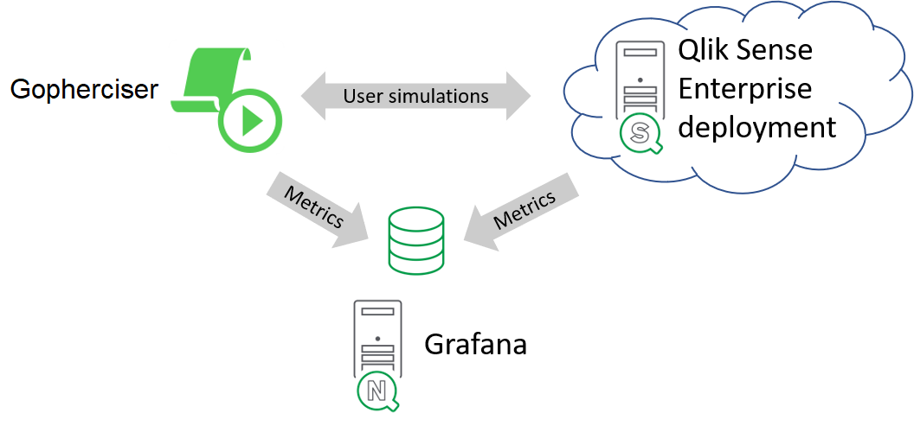

# Using Gopherciser for availability testing

An availability test is used to apply a low, constant workload towards a deployment in order to:
* Make sure that the deployment is up and running
* Identify long-term performance trends
* Detect concurrency-related problems
* Evaluate the response time for key user actions

Do the following to set up an availability test using Gopherciser:

1. Create a test scenario.

   When creating an availability test scenario, keep the following in mind:
   * Keep the user flow low.
   * Make sure to include key (important) actions.
  
   Save the test scenario as a script file (`.json` file).  

2. Create a script file (for example, a batch file, `.bat`, in case of Microsoft Windows, or a shell script file, `.sh`, in case of Linux) that executes the availability test scenario.

   Example of file contents (in case of a Microsoft Windows batch file):
   ```
   C:\performancetests\gopherciser\gopherciser execute -c C:\performancetests\gopherciser\Scenarios\AvailabilityTestScript.json
   ```
  
3. Select a scheduling mechanism (for example, the Task Scheduler in Microsoft Windows or the cron job scheduler in Linux) and configure it to run the batch / shell script file.

   **Note:** As the availability test scenario is to run on a regular basis, make sure to schedule enough time in between the executions, so that the next iteration is not started before the previous one has finished.

4. After each iteration, copy the test log file to a folder of your choice.

5. Create an availability test analyzer app that reloads the data from the test log file after each iteration.

6. (Optional:) Implement alerting based on metrics of interest (such as response times, errors, or failing actions).

   The following figure shows an example setup where Qlik NPrinting® and Grafana are used for alerting.

   