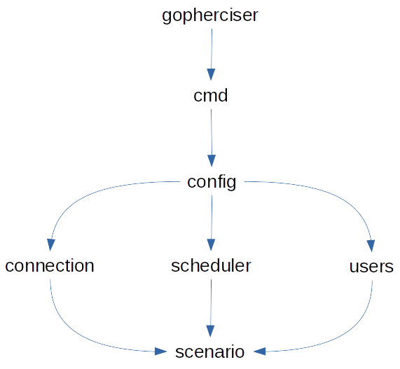

[build-cli]: ./build.md
[build-docker]: ./docker.md
[architecture]: ./architecture.md
[develop]: ./develop.md
[generate-docs]: ../../generatedocs/README.md

# Gopherciser code architecture

[build-cli] | [build-docker] | [develop] | [generate-docs] | [architecture]

Root of the project and main function.

## Main packages

### cmd

Command-line interface for controlling `gopherciser`. The main command is `execute`, which is used to run a test.

### config

Main handler for script files. Parses, validates and executes tests.

### connection

Defines how to authenticate towards an environment. There are currently two major methods, `jwt` and `ws`, which can be used with variations to "self-signed jwt", "header auth", "no auth" etc.

### scenario

Handles registration of existing actions and contains definitions of all default actions. Handles execution and reports results and statistics for all actions.

### scheduler

Defines the extendable scheduler interface. Includes the default "simple" scheduler, which schedules users based on ramp-up and iterations.

### users

Defines the users to simulate. The users can be based on lists or prefix.

## Other packages

### action

Handles action states. Used for reporting state, errors and possible extra details for logging.

### atomichandlers

Atomic objects and counters.

### buildmetrics

Handlers for Prometheus data.

### creation

Stub structs used when creating objects. 

### structs

Collection of data structs used by multiple actions.

### enigmahandlers

Handles connections towards the Qlik Associative Engine using the enigma.go library.

### enigmainterceptors

Interceptors for enigma.go connections.

### enummap

Library for defining enums.

### generatedocs

Tools to generate code readable documentation and markdown. 

### globals

Defines variables used globally in a test run.

### globals/constant

Defines global constants.

### helpers

Set of helper methods used in other packages.

### logger

Logging framework.

### metrics

Defines Prometheus metrics.

### precisiontime

Library for getting high-resolution timestamps.

### profile

Library for adding profiling capabilities.

### randomizer

Library for randomization of values. Each user gets a seeded randomizer based on instance and session numbers, which makes  tests reproducible.

### requestmetrics

Handles metrics for requests. Used to report the result of a test.

### senseobjdef

Handles the data structures of objects in Qlik Sense Enterprise. Decides how to select in objects, how to fetch data and where data resides in an object.

### senseobjects

Defines the structures of some default objects in Qlik Sense Enterprise.

### session

Handles the session state, which also includes handlers for pending requests.

### statistics

Handles the collection of statistics for actions and REST requests, which are used in the test summary.

### version

Struct used for setting the version of the tool.
